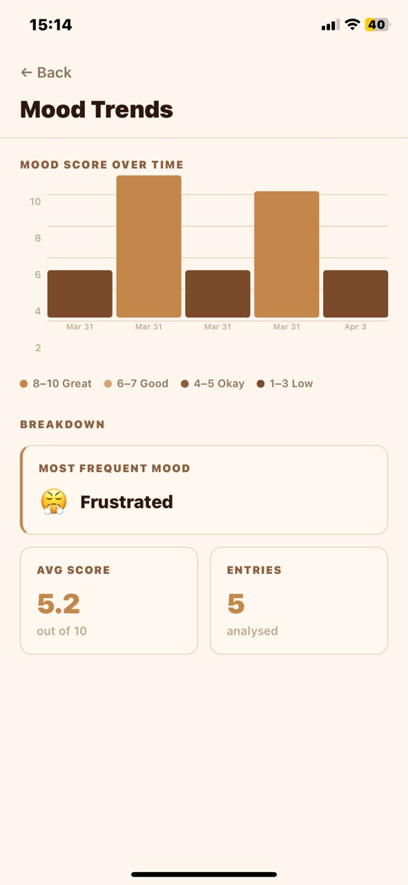
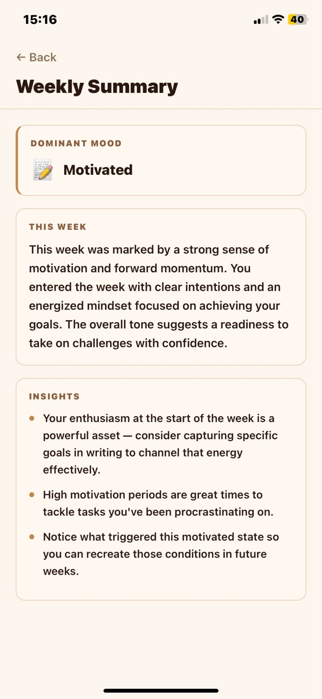

# AI Journal

An AI-powered journaling platform that helps users understand their emotional well-being through intelligent mood analysis, sentiment tracking, and personalized insights.

Rather than simply storing journal entries, AI Journal transforms personal reflections into actionable insights by identifying emotional patterns, analyzing sentiment, and generating meaningful summaries that help users better understand their mental and emotional state over time.

---

## The Problem

Most journaling applications function as digital notebooks. While they help users record thoughts and experiences, they provide little understanding of emotional trends, recurring patterns, or overall well-being.

AI Journal bridges that gap by combining journaling with AI-powered analysis, turning everyday entries into meaningful emotional insights.

---

## Key Outcomes

- AI-powered mood detection
- Personalized emotional insights
- Weekly trend analysis
- Secure authentication and user privacy
- Cross-platform mobile experience
- Offline-aware user experience
- Visual mood tracking and analytics

---

## Features

### AI Mood Analysis
Every journal entry is analyzed by an AI backend that returns:
- Mood classification
- Sentiment score (0–10)
- Personalized emotional insight

### Mood Trend Tracking
Visualize emotional patterns over time through:
- Mood trend charts
- Sentiment history
- Color-coded emotional scores

### Weekly AI Summaries
Generate intelligent weekly recaps including:
- Dominant emotional state
- Key themes and observations
- Personalized recommendations

### Search & Filter
- Full-text search across entries
- Filter by mood category
- Quickly discover past thoughts and patterns

### Secure Authentication
- Google OAuth login
- Email and password authentication
- Protected user-specific journal data

### Onboarding Experience
- First-launch introduction carousel
- Guided setup process
- Seamless user onboarding

### Offline Detection
- Real-time connectivity monitoring
- User notifications when offline

### Adaptive Theming
- Dark mode
- Light mode
- System-aware theme detection

### Haptic Feedback
Enhanced user interactions through tactile feedback on supported devices.

---

## Architecture

### Frontend
- React Native
- Expo
- Expo Router
- TypeScript

### Backend
- Node.js
- REST API
- Render Deployment

### Authentication
- Supabase Auth
- Google OAuth

### Database
- Supabase PostgreSQL
- Row-Level Security (RLS)

### AI Layer
- Mood Analysis Engine
- Sentiment Scoring
- Personalized Insight Generation
- Weekly Summary Generation

---

## Tech Stack

| Layer | Technology |
|---------|---------|
| Framework | React Native + Expo 54 |
| Router | Expo Router 6 |
| Language | TypeScript 5.9 |
| Authentication | Supabase Auth + Google OAuth |
| Database | Supabase PostgreSQL |
| Local Storage | AsyncStorage |
| AI Backend | Custom REST API deployed on Render |
| Testing | Vitest 4 |

---

## Project Structure

```text
ai-journal/
├── app/
│   ├── _layout.tsx
│   ├── onboarding.tsx
│   ├── (app)/
│   │   ├── index.tsx
│   │   ├── new-entry.tsx
│   │   ├── entry/[id].tsx
│   │   ├── charts.tsx
│   │   └── summary.tsx
│   └── (auth)/
│       ├── login.tsx
│       └── signup.tsx
├── config/supabase.ts
├── context/AuthContext.tsx
├── services/ai.ts
├── utils/time.ts
├── constants/colors.ts
└── __tests__/
```

---

## Screenshots


### Authentication


### Journal Dashboard


### Mood Insights


### Mood Analytics





### Weekly Summary




---

## Challenges Solved

### Transforming Journal Entries Into Insights

Journal entries are naturally unstructured and difficult to analyze manually.

**Solution**
- AI-powered sentiment analysis
- Mood classification
- Emotional trend identification
- Weekly summary generation

### Protecting Sensitive User Data

Personal journals contain highly sensitive information that must remain private.

**Solution**
- Supabase Authentication
- Row-Level Security (RLS)
- Protected API communication
- User-scoped data access

### Making Emotional Data Understandable

Raw sentiment scores alone provide little value to users.

**Solution**
- Visual mood charts
- Weekly summaries
- Personalized AI-generated insights
- Trend-based emotional tracking

### Cross-Platform Consistency

Ensuring a consistent experience across devices and operating systems.

**Solution**
- React Native
- Expo
- Shared codebase
- Adaptive theming

---

## AI-Assisted Development

This project was built using modern AI-assisted development workflows.

### Tools Used

- GitHub Copilot
- Claude
- AI-assisted debugging and documentation workflows

AI tools accelerated implementation, testing, and documentation while all architectural decisions, system design, feature prioritization, and final code reviews were performed manually.

---

## Getting Started

### Prerequisites

- Node.js 18+
- Expo CLI

```bash
npm install -g expo-cli
```

- Expo Go application for physical device testing

### Installation

```bash
git clone https://github.com/Kehinde13/ai-journal.git
cd ai-journal
npm install
```

### Environment Variables

Create a `.env` file in the project root:

```env
EXPO_PUBLIC_SUPABASE_URL=your_supabase_project_url
EXPO_PUBLIC_SUPABASE_ANON_KEY=your_supabase_anon_key
EXPO_PUBLIC_BACKEND_URL=https://ai-journal-backend-wqsi.onrender.com
EXPO_PUBLIC_GOOGLE_WEB_CLIENT_ID=your_google_web_client_id
EXPO_PUBLIC_GOOGLE_ANDROID_CLIENT_ID=your_google_android_client_id
EXPO_PUBLIC_GOOGLE_IOS_CLIENT_ID=your_google_ios_client_id
```

### Running the Application

```bash
npx expo start
npx expo start --android
npx expo start --ios
npx expo start --web
```

### Running Tests

```bash
npx vitest
npx vitest --coverage
```

---

## AI Backend

The application connects to a dedicated AI backend responsible for all sentiment analysis and insight generation.

### Base URL

```text
https://ai-journal-backend-wqsi.onrender.com
```

### Available Endpoints

| Endpoint | Method | Purpose |
|---------|---------|---------|
| `/api/analyse-entry` | POST | Generate mood label, sentiment score, and personalized insight |
| `/api/weekly-summary` | POST | Generate weekly emotional summary and key insights |

All requests are authenticated using the user's Supabase Bearer token.

---

## Database Schema

The `entries` table stores all journal data.

| Column | Type | Description |
|---------|---------|---------|
| id | uuid | Primary key |
| user_id | uuid | Foreign key to Supabase Auth |
| title | text | Optional journal title |
| content | text | Journal content |
| mood | text | AI-generated mood label |
| mood_score | numeric | Sentiment score (0–10) |
| insights | text | AI-generated insight |
| created_at | timestamp | Creation timestamp |

Row-Level Security (RLS) ensures users can only access and modify their own data.

---

## Future Enhancements

- Voice journaling
- AI journaling companion
- Advanced emotional forecasting
- Calendar-based mood tracking
- Exportable wellness reports
- Therapist and coach sharing features
- Rich analytics dashboard

---

## Why This Project Matters

AI Journal demonstrates the intersection of:

- Artificial Intelligence
- Mobile Development
- Secure Data Management
- User Experience Design
- Modern Full-Stack Engineering

The project showcases how AI can transform personal data into meaningful insights that improve self-awareness, emotional intelligence, and long-term well-being.
